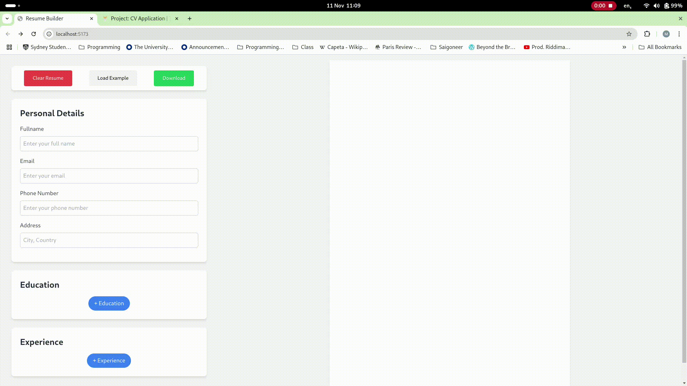

# CV Builder
As part of the Odin Project's curriculum, I created a CV builder using React. When building this project I split it into two main sections: the input and display sections. In the input section the user would be able to input and manipulate their personal information. This information would then be displayed in real time in the display section. The user can also download their CV as a pdf which I implemented using react-to-print and load an example CV if they need help. Finally I also used tailwind on this project which allowed me to style the CV builder in a screen size responsive manner.

## Deploy
https://minh-cv-builder.netlify.app/

## AppDemo
